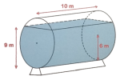

Fundamentos de Matemática

&nbsp;

<h1 align="center">Cilindros</h1>
<h4 align="center">Prof. Eduardo Ono</h4>
<h6 align="center">Atualizado em: 22/06/2025</h6>

&nbsp;

* [__exr-2023-08-14__](./exercicios-resolvidos/exr-2023-08-14.ipynb). Calcule o volume de água contida no cilindro na posição horizontal de 10 m de comprimento, diâmetro da base igual a 12 m, com nível da água em 9 m.

<h4 align="center">
  
</h4>

&nbsp;
