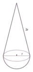

Fundamentos de Matemática

&nbsp;

<h1 align="center">Exercícios Resolvidos :: Cones</h1>
<h4 align="center">Prof. Eduardo Ono</h4>
<h6 align="center">Atualizado em: 22/06/2025</h6>

&nbsp;

## Área superficial

* [__Mackenzie-2006__](./exercicios-resolvidos/mackenzie-2006.ipynb). &nbsp; Uma boia marítima construída de uma determinada liga metálica tem o formato de uma gota que, separada em dois sólidos, resulta em um cone reto e em uma semiesfera, conforme a figura abaixo, na qual $\,r = 50\,\text{cm}\,$. Se o preço do $\text{m}^2$ da liga metálica é 1200 reais, adotando-se $\,\pi = 3\,$, o custo da superfície da boia é, em reais, igual a

|  |
| :-: |

&nbsp;
